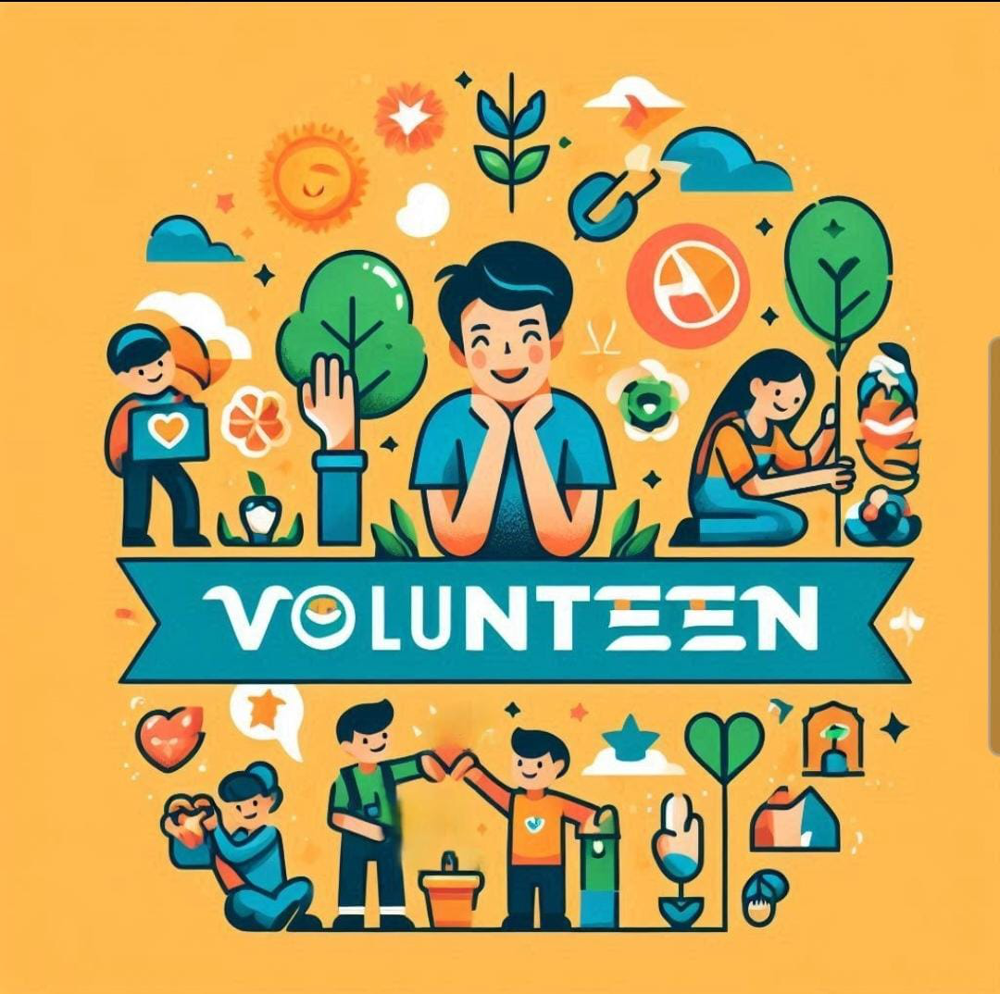
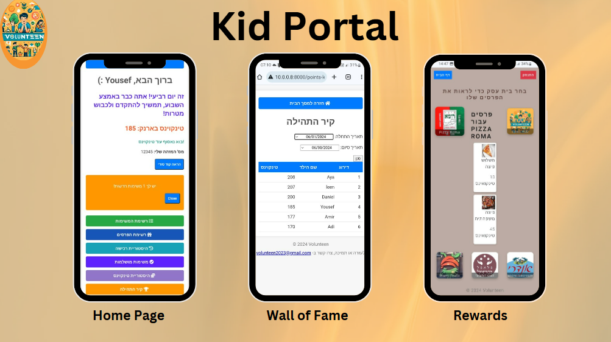
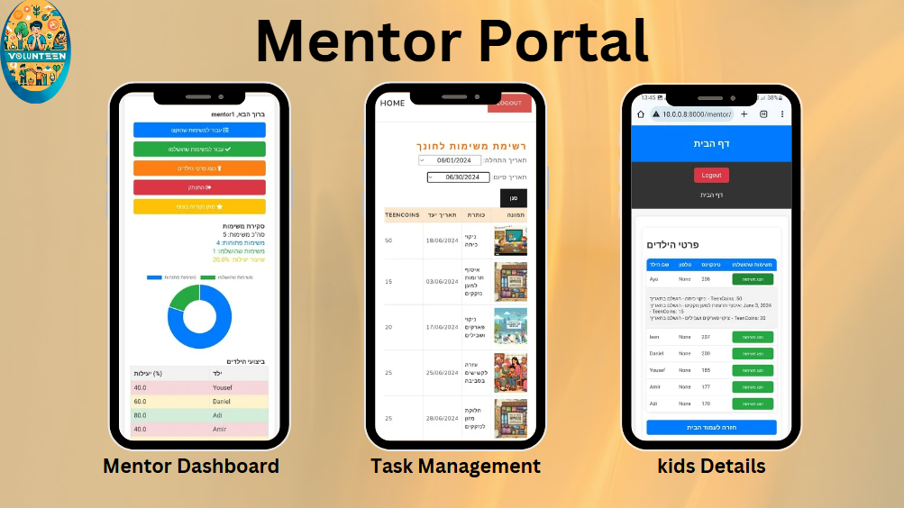
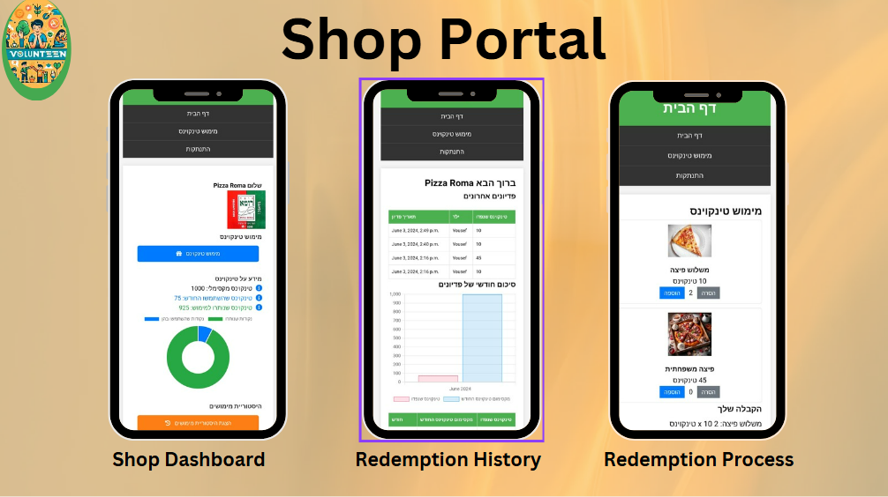

# Volunteen Project


## Description
Welcome to Volunteen! This project, Volunteen, is a system we developed to manage tasks that increase the involvement of children and youth in community projects. Each positive task they complete earns them points that can be redeemed for rewards through partnerships with local businesses.

Volunteen is structured following Uncle Bob's Clean Architecture principles, organized into four distinct layers:

- **Entities:** The core business logic.
- **Use Cases:** Application-specific business rules.
- **Interface Adapters:** Converters that transform data from the use cases to a format that can be used by the framework.
- **Frameworks & Drivers:** External interfaces such as databases, web frameworks, or other I/O components.

Below are screenshots showcasing different aspects of the **Volunteen** system:



**Screenshot of the Kids Portal, where children and youth can view and manage their tasks.**



**Screenshot of the Mentor Portal, where mentors can assign tasks and track progress.**



**Screenshot of the Shop Portal, where points can be redeemed for rewards.**

## Installation
To install Volunteen, follow these steps:

1. Clone the repository: `git clone https://github.com/Ahmad-danaf/Volunteen`
2. Navigate to the project directory: `cd volunteen`
3. [Optional] Set up a virtual environment: `python -m venv venv` (optional but recommended)
4. Activate the virtual environment:
   - On Windows: `venv\Scripts\activate`
   - On macOS and Linux: `source venv/bin/activate`
5. Install dependencies: `pip install -r requirements.txt`
   
## Structure
   ```bash
Volunteen/
│
├── README.md
├── requirements.txt
│
├── Volunteen/
│   ├── __pycache__/
│   ├── frameworks_and_drivers/
│   │   ├── __pycache__/
│   │   ├── __init__.py
│   │   ├── asgi.py
│   │   ├── settings.py
│   │   ├── urls.py
│   │   └── wsgi.py
│   │── staticfiles/
│   ├── static/
│   │   ├── css/
│   │   │   ├── assign_task.css
│   │   │   ├── child_home.css
│   │   │   ├── list_tasks.css
│   │   │   ├── mentor_children_details.css
│   │   │   ├── mentor_home.css
│   │   │   ├── not_enough_points.css
│   │   │   ├── reward.css
│   │   │   ├── shop_home.css
│   │   │   ├── shop_no_rewards.css
│   │   │   ├── shop_redeem_points.css
│   │   │   └── shop_redemption_success.css
│   │   │
│   │   ├── images/
│   │   │   ├── volunteen_logo.jpeg
│   │   │   ├── volunteen.jpg
│   │   │   └── logo.png
│   │   │
│   │   └── js/
│   │       ├── child_home.js
│   │       ├── list_tasks.js
│   │       ├── mentor_children_details.js
│   │       ├── mentor_completed_task_view.js
│   │       ├── mentor_home.js
│   │       ├── mentor_task.js
│   │       ├── reward.js
│   │       ├── scripts.js
│   │       ├── shop_home.js
│   │       └── shop_redemption_history.js
│   │
│   ├── teenApp/
│   │   ├── __pycache__/
│   │   ├── entities/
│   │   │   ├── __pycache__/
│   │   │   ├── __init__.py
│   │   │   ├── child.py
│   │   │   ├── mentor.py
│   │   │   ├── redemption.py
│   │   │   ├── reward.py
│   │   │   ├── shop.py
│   │   │   └── task.py
│   │   │
│   │   ├── interface_adapters/
│   │   │   ├── __pycache__/
│   │   │   ├── __init__.py
│   │   │   ├── forms.py
│   │   │   ├── repositories.py
│   │   │   ├── urls.py
│   │   │   ├── child_views.py
│   │   │   ├── mentor_views.py
│   │   │   ├── shop_views.py
│   │   │   └── views.py
│   │   │
│   │   ├── templates/
│   │   │   ├── two_factor/
│   │   │   ├── add_task.html
│   │   │   ├── assign_bonus.html
│   │   │   ├── assign_points.html
│   │   │   ├── assign_task.html
│   │   │   ├── base.html
│   │   │   ├── child_active_list.html
│   │   │   ├── child_completed_tasks.html
│   │   │   ├── child_home.html
│   │   │   ├── child_points_history.html
│   │   │   ├── edit_task.html
│   │   │   ├── list_tasks.html
│   │   │   ├── mentor_children_details.html
│   │   │   ├── mentor_completed_tasks_view.html
│   │   │   ├── mentor_home.html
│   │   │   ├── not_enough_points.html
│   │   │   ├── points_assigned_success.html
│   │   │   ├── points_leaderboard.html
│   │   │   ├── shop_base.html
│   │   │   ├── shop_invalid_identifier.html
│   │   │   ├── shop_no_rewards.html
│   │   │   ├── shop_not_enough_points.html
│   │   │   ├── shop_redemption_history.html
│   │   │   └── shop_redemption_success.html
│   │   │
│   │   ├── use_cases/
│   │   │   ├── __pycache__/
│   │   │   ├── __init__.py
│   │   │   ├── assign_bonus_points.py
│   │   │   ├── assign_points.py
│   │   │   ├── assign_task.py
│   │   │   └── manage_child.py
│   │   │
│   │   ├── admin.py
│   │   ├── apps.py
│   │   ├── tests.py
│   │   └── views.py
│   │
│   └── db.sqlite3
│
├── media/
│
└── manage.py

```

## Usage
To use Volunteen, follow these steps:

1. Apply database migrations:
   ```bash
   python manage.py migrate
   
2. Create a superuser account
   ```bash
   python manage.py createsuperuser
   ```
   Follow the prompts to set up your admin username and password.

3. Run the Django development server:
   ```bash
   python manage.py runserver
4. Open your web browser and navigate to http://127.0.0.1:8000/ to access the homepage.
5. Log in using the appropriate user credentials:
 - For children: use the credentials provided during registration.
 - For mentors: use the mentor credentials.
 - For shop owners: use the shop owner credentials.
6. Children can view and complete tasks assigned to them, earning points for each completed task.
7. Mentors can assign tasks to children and monitor their progress.
8. Shop owners can manage reward redemptions and track points used by children.
9. Use the admin panel to manage users, tasks, and rewards: http://127.0.0.1:8000/admin/


## Built With
- [Python](https://www.python.org/) - The programming language used.
- [Django](https://www.djangoproject.com/) - The web framework used.
- [SQLite](https://www.sqlite.org/index.html) - The database used.
- [HTML/CSS/JavaScript](https://developer.mozilla.org/en-US/docs/Learn/Getting_started_with_the_web/HTML_basics) - For the frontend components.
- [Bootstrap](https://getbootstrap.com/) - For responsive design and styling.
- [Git](https://git-scm.com/) - Version control system.
- [AWS](https://aws.amazon.com/) - Used for deployment.
- 
## License
This project is licensed under the MIT License - see the [LICENSE](LICENSE) file for details.

